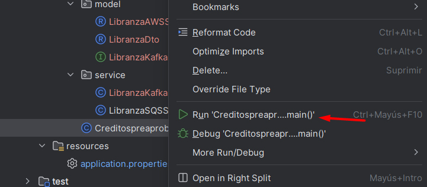

# Contexto de la aplicación

La aplicación es capaz de subir mensajes en kafka ya sea por medio del endpoint **on-demand**
o por medio del endpoint **sqs-promociones**, los cuales se pueden verificar en la cola de
AWS SQS **libranza-promociones**

## Para inicializar Kafka local
Para inicializar kafka local se debe ejecutar el siguiente comando, estando en la 
raíz de este proyecto donde se encuentra en docker-compose.yml:
```
# sudo service docker start
# docker-compose up -d
``` 
**NOTA**: Fue necesario hacer la ejecución manualmente, ya que desde el IDE no 
encontraba el comando docker-compose

## Ejecución del proyecto
Basta con ejecutar la clase CreditospreaprobadoskafkaApplication


## Para verificar salud de la aplicación
Con la siguiente API se procede a comprobar la salud de la 
aplicación -> [Health](http://localhost:6091/api/actuator/health)
```
http://localhost:6091/api/actuator/health
```

## Endpoints
Todos los endpoints se pueden verificar y ejecutar entrando al siguiente enlace luego 
de ejecutar el proyecto

[Swagger-UI](http://localhost:6091/api/swagger-ui.html)

```
http://localhost:6091/api/swagger-ui.html
```